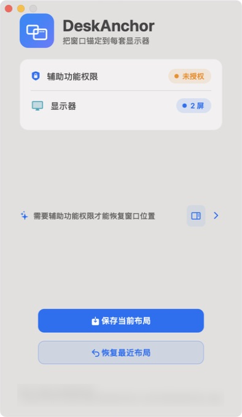
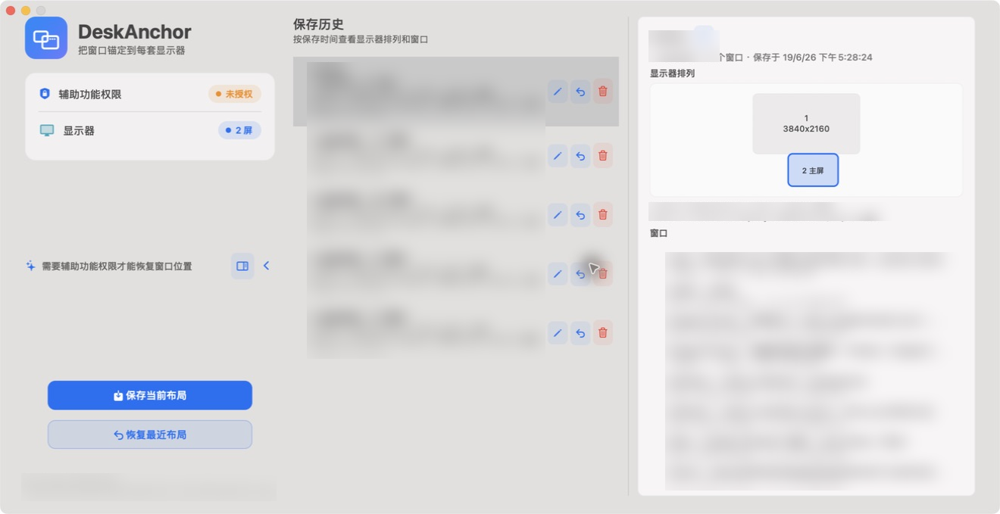

# DeskAnchor



[中文](#中文) | [English](#english)

## 中文

DeskAnchor 是一款 macOS 菜单栏软件，用来保存和恢复不同显示器环境下的窗口位置。

当你在办公室三屏、家里双屏、外出便携屏之间切换时，DeskAnchor 会识别当前显示器组合，并把常用应用窗口尽可能恢复到上次保存的位置和尺寸。它不读取屏幕内容，不上传窗口信息，所有布局数据都保存在本机。

### 核心功能

| 功能 | 说明 |
| --- | --- |
| 显示器组合识别 | 记录显示器数量、名称、分辨率、缩放和相对排列 |
| 一键保存布局 | 保存当前标准 macOS 应用窗口的位置和尺寸 |
| 一键恢复布局 | 在当前显示器组合下恢复最近保存的窗口布局 |
| 自动恢复 | 显示器变化或电脑唤醒后，等待环境稳定再尝试恢复 |
| 保存历史 | 查看、命名、恢复或删除不同时间保存的布局 |
| 菜单栏常驻 | 保持低打扰运行，可从菜单栏快速保存、恢复和暂停自动恢复 |
| 本地持久化 | 布局保存到本机 JSON 文件，不依赖账号或云服务 |

### 系统要求

- macOS 13 或更新版本
- Apple Silicon 或 Intel Mac
- 辅助功能权限，用于读取窗口位置并移动窗口

DeskAnchor 不需要屏幕录制权限，不读取窗口内容，也不会截屏。

### 下载与安装

当前仓库还没有创建正式 GitHub Release。现阶段可以使用仓库内已经构建好的 DMG：

```bash
open dist/DeskAnchor-0.1.0.dmg
```

打开 DMG 后，将 `DeskAnchor.app` 拖入 `Applications` 文件夹，再从 `Applications` 启动 DeskAnchor。

正式发布后，安装包会放在 [GitHub Releases](https://github.com/songofhawk/deskanchor/releases) 页面下载。当前本地打包脚本使用 ad-hoc 签名，适合开发和内部验证；公开分发前建议使用 Developer ID 签名并完成 notarization。

### 首次授权

首次保存或恢复布局前，需要授予辅助功能权限：

1. 启动 DeskAnchor。
2. 点击主界面中的“未授权”，或菜单栏中的“打开辅助功能设置...”。
3. 在系统设置中进入 `隐私与安全性` -> `辅助功能`。
4. 打开 `DeskAnchor` 的开关。
5. 回到 DeskAnchor，确认状态显示为“已授权”。

### 使用方法

#### 保存一个布局

1. 连接当前工作环境下的显示器。
2. 手动摆放好常用应用窗口。
3. 点击主界面的“保存当前布局”，或从菜单栏选择“保存当前布局”。
4. DeskAnchor 会保存当前显示器组合和可访问窗口的位置。

#### 恢复最近布局

1. 重新连接一个已经保存过的显示器组合。
2. 点击“恢复最近布局”，或从菜单栏选择“恢复当前显示器布局”。
3. DeskAnchor 会匹配当前正在运行的窗口，并移动可恢复的窗口。

#### 使用自动恢复

默认开启自动恢复。DeskAnchor 会在这些场景中尝试恢复：

- 显示器数量或排列发生变化后
- Mac 从睡眠中唤醒后

如果你正在演示、投屏或临时调整窗口，可以从菜单栏选择“暂停自动恢复”；需要时再选择“开启自动恢复”。

#### 管理保存历史

主界面右侧的历史面板可以查看保存过的布局。你可以：

- 查看保存时间、显示器排列和窗口列表
- 给某条历史命名
- 恢复指定历史
- 删除不再需要的历史

每个显示器组合最多保留 20 条历史记录。



### 数据与隐私

DeskAnchor 的布局数据保存在：

```text
~/Library/Application Support/DeskAnchor/layouts.json
```

文件内容包括显示器信息、窗口所属应用、窗口标题指纹、窗口位置和尺寸。DeskAnchor 不提供云同步，不上传这些数据，也不读取窗口画面。

### 已知限制

macOS 没有公开 API 能保证移动所有窗口。DeskAnchor 会尽可能恢复标准 macOS 应用窗口，但以下情况可能无法恢复或只能部分恢复：

- 全屏窗口、Split View 窗口或位于其他 Space 的窗口
- 系统保护窗口
- 部分 Electron、Java、游戏或自绘窗口
- 未运行的应用窗口
- 窗口标题或结构发生明显变化后的窗口

DeskAnchor 不会自动启动未运行的 App，也不会强制移动匹配不到的窗口。

### 从源码构建

```bash
git clone https://github.com/songofhawk/deskanchor.git
cd deskanchor
swift build
.build/debug/DeskAnchor
```

运行测试：

```bash
swift test
```

生成可安装的 DMG：

```bash
scripts/package-app.sh
open dist/DeskAnchor-0.1.0.dmg
```

打包脚本会生成 `.build/DeskAnchor.app` 和 `dist/DeskAnchor-0.1.0.dmg`。

### 故障排查

| 现象 | 处理方式 |
| --- | --- |
| 保存或恢复提示需要权限 | 到系统设置的辅助功能列表中启用 DeskAnchor |
| 恢复后没有窗口移动 | 确认该显示器组合已经保存过布局，且目标 App 正在运行 |
| 只恢复了一部分窗口 | 目标窗口可能不支持 Accessibility 移动，或窗口已经进入全屏/其他 Space |
| 菜单栏没有图标 | 重新启动应用；如果仍不可见，检查是否被菜单栏管理工具隐藏 |
| 想重置保存数据 | 退出应用后删除 `~/Library/Application Support/DeskAnchor/layouts.json` |

## English

DeskAnchor is a macOS menu bar app for saving and restoring window layouts across different monitor setups.

When you move between a three-display office desk, a dual-display home setup, and a portable external monitor, DeskAnchor recognizes the current display set and tries to put your everyday app windows back where they were last saved. It does not read screen contents, does not take screenshots, and keeps layout data on your Mac.

### Highlights

| Feature | Description |
| --- | --- |
| Display-set detection | Records display count, names, resolution, scaling, and relative arrangement |
| Save current layout | Saves position and size for accessible standard macOS app windows |
| Restore current layout | Restores the latest saved layout for the current display set |
| Auto restore | Tries to restore after display changes or wake from sleep |
| Layout history | View, name, restore, or delete saved layout snapshots |
| Menu bar first | Runs quietly in the menu bar with quick save, restore, and pause actions |
| Local storage | Stores layouts locally as JSON; no account or cloud service required |

### Requirements

- macOS 13 or later
- Apple Silicon or Intel Mac
- Accessibility permission, used to read and move windows

DeskAnchor does not require Screen Recording permission, does not inspect window contents, and does not capture screenshots.

### Download And Install

This repository does not have a formal GitHub Release yet. For now, use the already-built DMG in this repository:

```bash
open dist/DeskAnchor-0.1.0.dmg
```

After opening the DMG, drag `DeskAnchor.app` into `Applications`, then launch DeskAnchor from `Applications`.

After the first public release is created, installers will be available from the [GitHub Releases](https://github.com/songofhawk/deskanchor/releases) page. The current local packaging script uses ad-hoc signing, which is suitable for development and internal testing; a public release should use Developer ID signing and notarization.

### First-Time Permission

Before DeskAnchor can save or restore layouts, grant Accessibility permission:

1. Launch DeskAnchor.
2. Click `未授权` (`Unauthorized`) in the main window, or choose `打开辅助功能设置...` (`Open Accessibility Settings...`) from the menu bar.
3. In System Settings, go to `Privacy & Security` -> `Accessibility`.
4. Enable `DeskAnchor`.
5. Return to DeskAnchor and confirm the permission state is authorized.

### How To Use

#### Save A Layout

1. Connect the displays for your current desk setup.
2. Arrange your everyday app windows manually.
3. Click `保存当前布局` (`Save Current Layout`) in the main window, or choose the same action from the menu bar.
4. DeskAnchor stores the current display set and accessible window positions.

#### Restore The Latest Layout

1. Reconnect a display set that you have saved before.
2. Click `恢复最近布局` (`Restore Latest Layout`), or choose `恢复当前显示器布局` (`Restore Current Display Layout`) from the menu bar.
3. DeskAnchor matches currently running windows and moves the windows it can restore.

#### Use Auto Restore

Auto restore is enabled by default. DeskAnchor tries to restore after:

- The display count or arrangement changes
- The Mac wakes from sleep

If you are presenting, screen sharing, or temporarily arranging windows by hand, choose `暂停自动恢复` (`Pause Auto Restore`) from the menu bar. Turn it back on with `开启自动恢复` (`Enable Auto Restore`) when needed.

#### Manage Layout History

The history panel in the main window shows saved snapshots. You can:

- Review saved time, display arrangement, and window list
- Rename a snapshot
- Restore a specific snapshot
- Delete snapshots you no longer need

Each display set keeps up to 20 history entries.


### Data And Privacy

DeskAnchor stores layout data at:

```text
~/Library/Application Support/DeskAnchor/layouts.json
```

The file contains display information, app ownership, window title fingerprints, window positions, and window sizes. DeskAnchor does not provide cloud sync, does not upload this data, and does not read window pixels.

### Known Limitations

macOS does not provide a public API that can move every window reliably. DeskAnchor tries to restore standard macOS app windows, but these cases may not restore or may only partially restore:

- Full-screen windows, Split View windows, or windows on another Space
- System-protected windows
- Some Electron, Java, game, or custom-drawn windows
- Windows for apps that are not currently running
- Windows whose titles or structures changed significantly after saving

DeskAnchor does not launch apps automatically and does not move windows it cannot match.

### Build From Source

```bash
git clone https://github.com/songofhawk/deskanchor.git
cd deskanchor
swift build
.build/debug/DeskAnchor
```

Run tests:

```bash
swift test
```

Create an installable DMG:

```bash
scripts/package-app.sh
open dist/DeskAnchor-0.1.0.dmg
```

The packaging script creates `.build/DeskAnchor.app` and `dist/DeskAnchor-0.1.0.dmg`.

### Troubleshooting

| Symptom | Fix |
| --- | --- |
| Save or restore says permission is required | Enable DeskAnchor in System Settings -> Privacy & Security -> Accessibility |
| Restore does not move any windows | Confirm this display set has a saved layout and the target apps are running |
| Only some windows are restored | Some windows may not support Accessibility movement, or may be full-screen/on another Space |
| The menu bar icon is missing | Relaunch the app; if still hidden, check any menu bar management utility |
| Reset saved data | Quit the app, then delete `~/Library/Application Support/DeskAnchor/layouts.json` |
